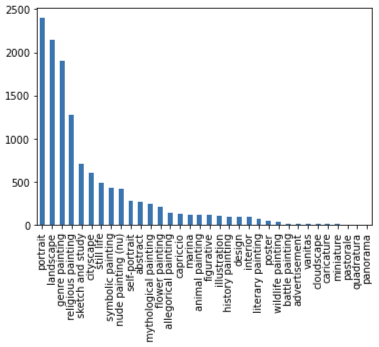
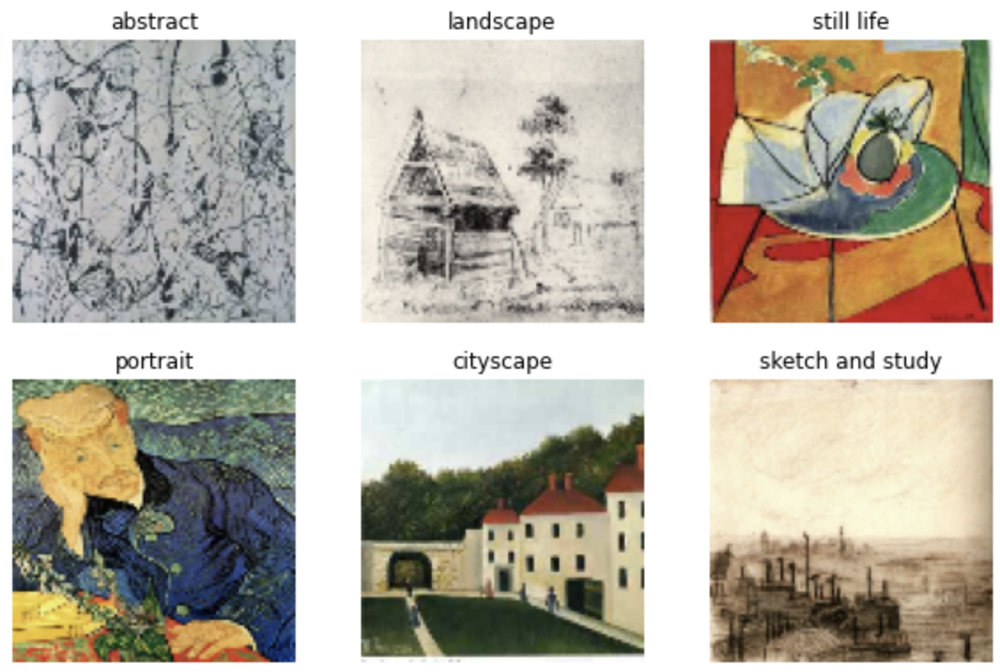
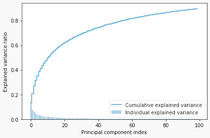
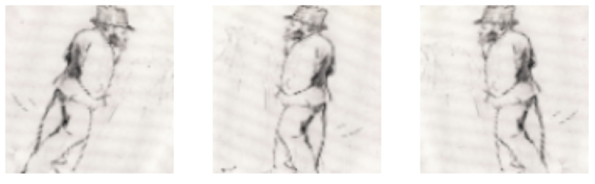
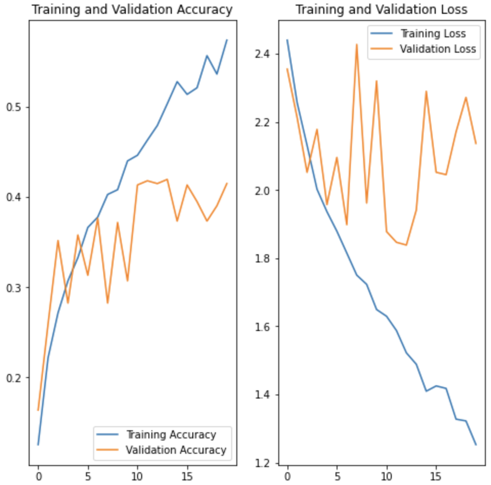
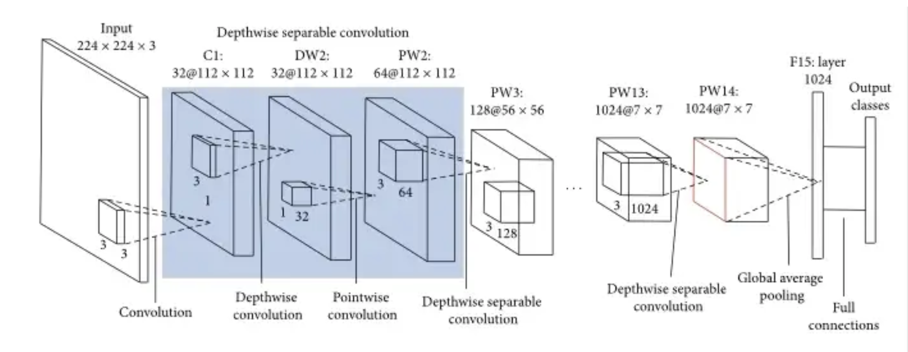
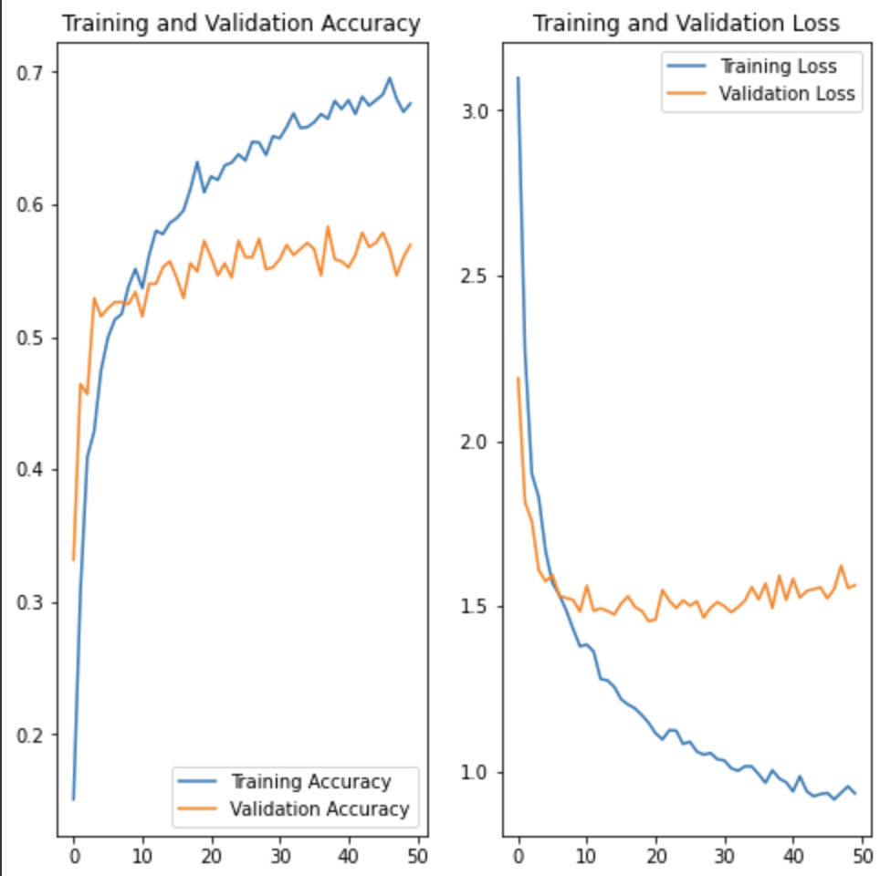
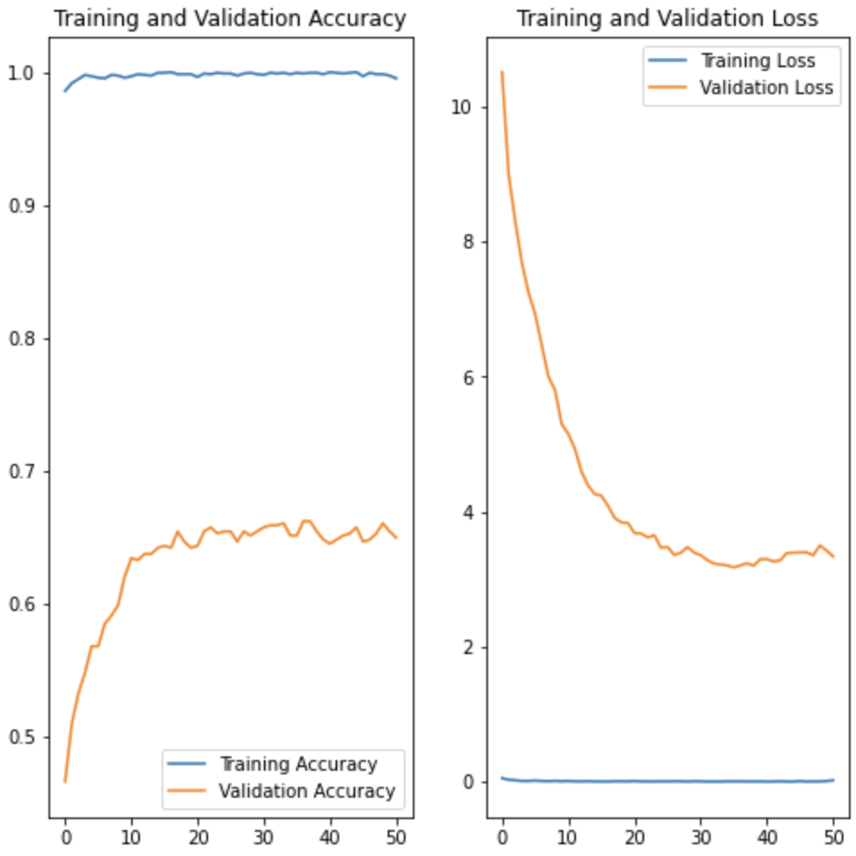
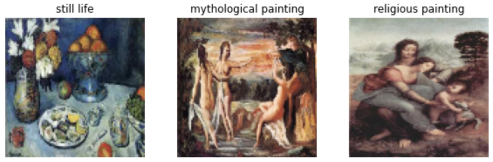

# ArtyLyze

<embed width="800" height="500" src="https://www.youtube.com/embed/J0ZKjrVC2QY" title="YouTube video player" frameborder="0" allow="accelerometer; autoplay; clipboard-write; encrypted-media; gyroscope; picture-in-picture" allowfullscreen>

## Introduction
- Since the advent of digitalization, millions of artworks have been digitized, opening up the world of art to countless new people. However, navigating this space for a layman is difficult due to the lack of metadata and contextual information needed to describe and understand the artwork. 
- Unless one knows title and artist of an artwork, finding the artwork is almost impossible. In this research project, we use both supervised and unsupervised models to generate metadata given an image of an artwork. 
- Specifically, given an artwork, we will try to predict the genre, time period, geography and the artist. So far we have focussed solely on genre classification which we will further extrapolate  to time period, geography and the artist at our final update. 
- We have collected dataset of ~12k images which is a subset of [MultitaskPainting100k](http://www.ivl.disco.unimib.it/activities/paintings/). 

## Problem Definition
1. *Throughout history it has been observed that artistic collaborations fuel creativity and give rise to art movements.* Our study aims to find correlations between different artistic styles spanning geographies and periods, which would help track the journey of art and how it evolved. Soft clustering approaches can help deduce influence of different factors (genre, time period, geography) on a particular work of art. Studying similarity and influence across time and geography between different art styles is a relevant research area.
2. We wish to build a model that can classify an artwork according to its genre, time period, geography etc. If possible we would like to study the features the model learns that helps it differentiate between different kinds of artworks.


<!-- ## Related Work 
| Research                                                                                                                                         | Datasets                                                                                        | Models              | Predictions        | Metrics                                                     | Year |
|----------------------------------------------------------------------------------------------------------------------------------------------------|---------------------------------------------------------------------------------------------------|-----------------------|----------------------|---------------------------------------------------------------|---------|
| [Large-scale Classification of Fine-Art Paintings: Learning The Right Metric on The Right Feature](https://arxiv.org/pdf/1505.00855.pdf)             | [WikiArt](https://www.wikiart.org/)                                                                 | Classemes, Picodes, CNN | Style, Genre, Artist   | Accuracy: 63%                                                   | 2015      |
| [Compare the performance of the models in art classification](https://journals.plos.org/plosone/article?id=10.1371/journal.pone.0248414)             | Painting-91, Wikiart, Multitask Painting100K                                                         | CNN                     | Style, Genre, Artist  | <ul> <li>Painting-91: 80% <li>Wikiart: 91% <li>Multitask Painting100K: 65% | 2021      |
| [Classifying digitized art type and time period](https://www.jevinwest.org/papers/Yang2018KDDart.pdf)                                                | 300k images from: Metropolitan Museum of Art, WikiArt and Artsy                                     | CNN                     | Type, Time period     | Accuracy for type: 87%, for time: 57%                           | 2018      |
| [The Effect of Derived Features on Art Genre Classification with Machine Learning](http://www.saujs.sakarya.edu.tr/en/download/article-file/1668894) | [50 Most Influential Artists ](https://www.kaggle.com/datasets/ikarus777/best-artworks-of-all-time) | Random Forest           | Genre            | F1 score: 82%                                                   | 2021      | -->

## Dataset
### Dataset Collection and Creation
Dataset of ~12k images which is a subset of [MultitaskPainting100k](http://www.ivl.disco.unimib.it/activities/paintings/). The original dataset has 100k images from 1508 different artists. But this datatset only contains artist name, style and genre hence we used [Best Artworks of All Time](https://www.kaggle.com/datasets/ikarus777/best-artworks-of-all-time?resource=download) to create a subset. [Best Artworks of All Time](https://www.kaggle.com/datasets/ikarus777/best-artworks-of-all-time?resource=download) contains 50 artists, 8671 paintings with artist name, genre, nationality and years, but there is only a one to one mapping between each painting, artist and genre. Hence, we created a subset data with artist name, genre, style, nationality and years by sampling images from the MultitaskPainting100k corresponding to 46 artists in Best Artworks of All Time. 
The final filtered subset has a total of 12,619 images split into train and test set of 8837 and 3782 images respectively.

### Dataset Cleaning
Our filtered dataset exhibited a class imbalance issue, hence we selected only the top 12 classes with highest represnetation and undersampled them to balance the dataset. 

This balanced dataset contains a total of 2556 samples which are split into training and validation set of 1908 and 648 respectively. 
With our future updates we plan on tackling this data imbalance issue better to incorporate more classes by using a combination of data based, loss weighting and metric weighting based methods. 


### Dataset Preprocessing 
- Unsupervised Classification 
For our unsupervised classification we need feature embeddings of each image. Since CNNs are very good automatic feature extractors we use a mobilent model to extract features by saving the feature map obtained from the fully connected layer of the model. This gives us a dataset with a dimensionality of 1000 since the model outputs a feature map of 1000 features. We further used PCA for dimensionality reduction and reduced our feature space to 100 which captures 85% of the variance of our original data. 


- Supervised Classification
Since we want our model to generalize well and focus on important underlying features for style prediction we perform a few simple data augmentation practices like flipping and rotation along the vertical axis. 

 
Each image in our dataset is an RGB image of size 180x180x3 where where 180 is the height and width of the image and 3 is the number of channels. The RGB channel values are in the [0, 255] range. This is not ideal for a neural network; in general we should seek to make our input values small. Hence, we standardize values to be in the [0, 1] range. 

The final input to our model is a tensor of size (32, 180, 180, 3) where 32 is the batchsize. 
 
## Methods
We employ both supervised and unsupervised methods for this project. 
### Supervised classification:
For supervised classification we use Convolutional Neural Networks, to understand if CNNs are able to capture the information, we experimented with a basic neural network with 3 convolutional layers and dropout. As expected the model was unable to perform well and produced very noisy results. 




Since our aim is to also achieve good results with good computational efficiency we decided to use the MobileNet architecture to build our prediction pipeline. Another reason for going with MobileNet being given its computational efficiency it will lead to faster experimentations which helps us better engineer the other parts of our pipeline like loss, optimizers, hyperparameters.



We further performed hyperparameter tuning to arrive at the learning rate of 1e-4 as a good approximation for the optimum value. 
In our first few experiments with MobileNet we froze the backbone which gave us consistent results across both training and validation sets. 




To improve performance we fine-tuned the MobileNet backbone with our dataset which boosted our accuracy on the testing set. 




![Conv]

### Unsupervised classification: 
For unsupervised classification we use 2 methods KMeans and GMM to form different clusters across the paintings. For kmeans we obtain the optimal value for the number of clusters using the elbow plot. After running these algorithms we obtain a x clusters , a few samples from the different clusters are displayed below. If we closely observe the clusters we can see that each of these clusters have similarities across their styles of painting, the classifier is able to understand the underlying pattern. 


KMeans performs hard clustering hence it is difficult to understand if a particular painting has been exposed to multiple influences. Hence we use GMM to understand the influence of different styles on a particular painting. 


## Results and Discussion
### Supervised 
We compared the performance of our supervised models using accuracy, f1, precision and recall score.  

It can be clearly observed that a 3 layer CNN is extremely noisy and unable to learn well, its capacity of learning is lower. The MobileNet model performed significantly better than the convolution model with better values across all the metrics. To improve its performance we experimented with different learning rates and obtained the following results. Based on these results we obtained at the optimum learning rate of 1e-4. 

| Model | Accuracy | Precision | Recall | F1 |
| --- | --- | --- | --- | --- |
| 3 layer CNN | 0.42| 0.47|0.42 |0.40 |
| Mobilenet backbone (frozen); LR = 1e-4| 0.57 | 0.59 | 0.57 | 0.57 |
| Mobilenet backbone (frozen); LR = 5e-4 | 0.54| 0.54| 0.54 | 0.53 |
| Mobilenet backbone (frozen); LR = 1e-3 | 0.44 | 0.68 | 0.44 | 0.44 |
| Mobilenet backbone (fine-tuning)| 0.65 | 0.66 | 0.65 | 0.65 |


Further experiments are performed by fine-tuning the MobileNet backbone with our datatset. The results clearly show that fine-tuning yields significantly better results. 



### Unsupervised 
For our unsupervised algorithms feature selection and distance function are very important measures. Our features should be representative our data and what we want the model to capture. Every clustering algorithm uses a different distance function, it is important to understand whether the distance function is a good measure to calculate the similarities between datapoints in the given dataset.  
In our project we used silhouette coefficient and davies bouldin index to measure the performance of our clustering algorithms. 

### Future Work 
- Currently we are experimenting with CNNs to arrive at the best model architecture, loss and hyperparameters for classification hence we have only focussed on genre classification, for our final update we will extend this to style,nationality and years.
- For our final update we will perform another iteration on the dataset to incorporate more classes while tackling data imbalance using loss and metric weighting approaches. 
- For unsupervised classification we will improve further on our clustering models by experimenting with better feature selectors. 
- As our final analysis we will associate each cluster with a main theme and try to analyse which themes are more closely associated with each other based on intra-cluster distances. We will also analyse a few paintings to understand different influences across nationalities and time periods. 
## Team
Anisha Pal, Avinash Prabhu, Meher Shashwat Nigam, Mukul Khanna, Shivika Singh
### Work Distribution
[Link to Gantt Chart](https://docs.google.com/spreadsheets/d/1LRcJbVBx7WDqoV-0qWDu1E3mkWw_PsMho9b2ql4kQBE/edit?usp=sharing)

## References
```
@misc{saleh2015largescale,
      title={Large-scale Classification of Fine-Art Paintings: Learning The Right Metric on The Right Feature}, 
      author={Babak Saleh and Ahmed Elgammal},
      year={2015},
      eprint={1505.00855},
      archivePrefix={arXiv},
      primaryClass={cs.CV}
}
@article{10.1371/journal.pone.0248414,
    doi = {10.1371/journal.pone.0248414},
    author = {Zhao, Wentao AND Zhou, Dalin AND Qiu, Xinguo AND Jiang, Wei},
    journal = {PLOS ONE},
    publisher = {Public Library of Science},
    title = {Compare the performance of the models in art classification},
    year = {2021},
    month = {03},
    volume = {16},
    url = {https://doi.org/10.1371/journal.pone.0248414},
    pages = {1-16},
}
@article{ saufenbilder904964, 
    journal = {Sakarya University Journal of Science},
    year = {2021}, volume = {25}, number = {6}, pages = {1275 - 1286}, 
    doi = {10.16984/saufenbilder.904964}, 
    title = {The Effect of Derived Features on Art Genre Classification with Machine Learning}, 
    author = {Abidin, Didem} 
}
@inproceedings{Yang2018ClassifyingDA,
  title={Classifying digitized art type and time period},
  author={Sean T. Yang and Bum Mook Oh},
  year={2018}
}
```
