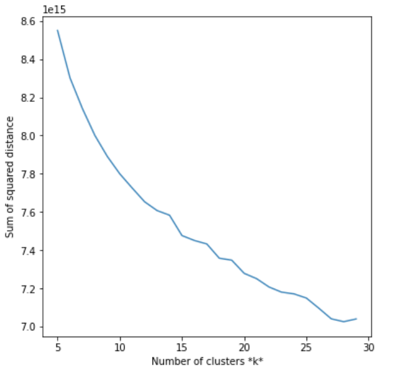
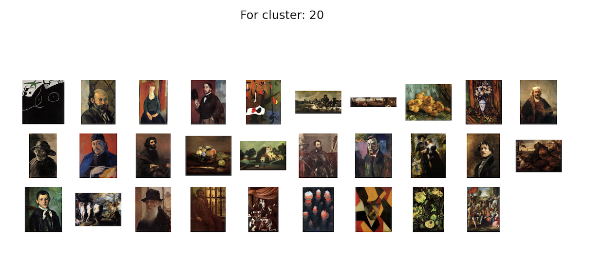
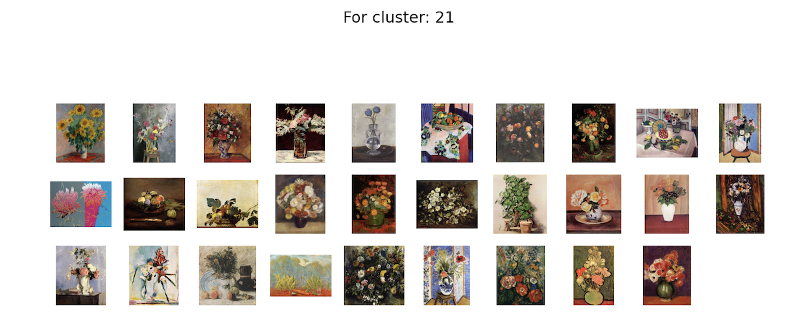
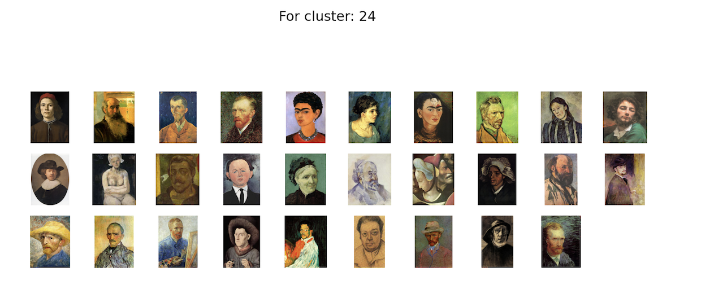
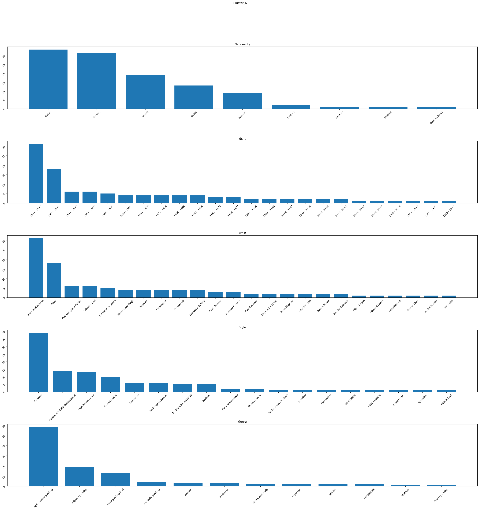
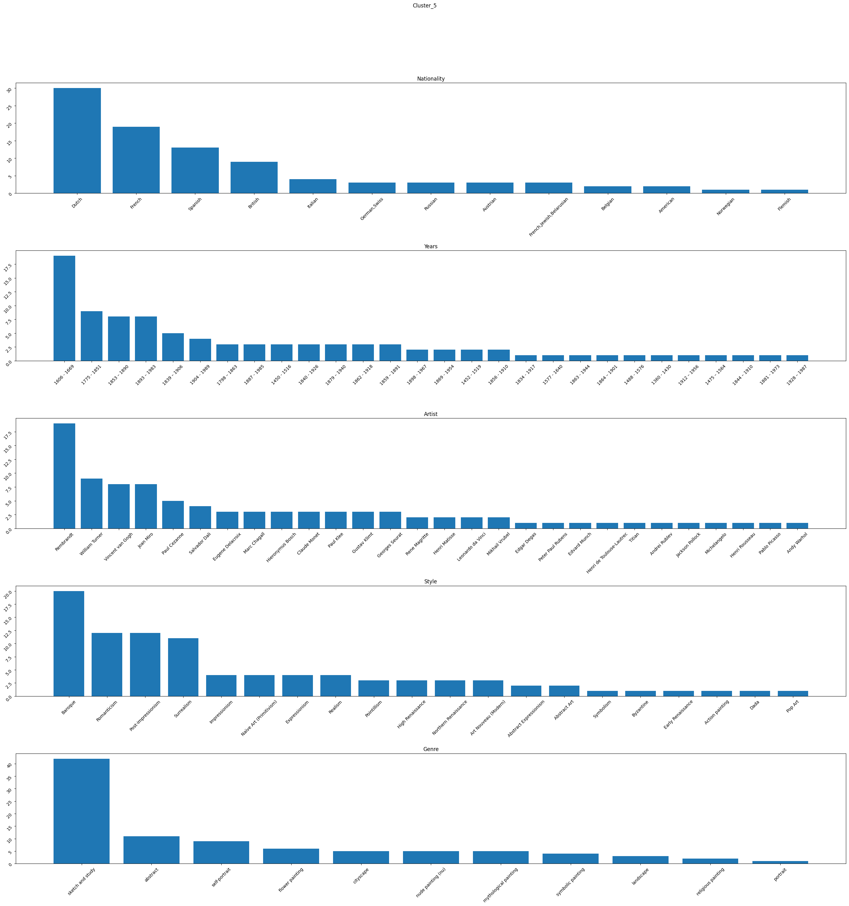
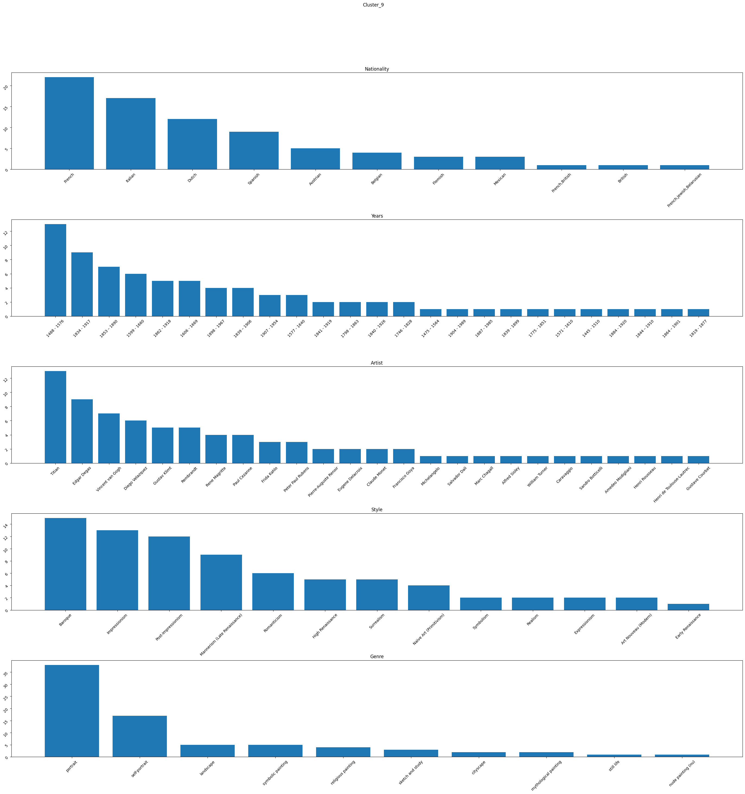

# ArtyLyze

## Introduction
- Since the advent of digitalization, millions of artworks have been digitized, opening up the world of art to countless new people. However, navigating this space for a layman is difficult due to the lack of metadata and contextual information needed to describe and understand the artwork. 
- Unless one knows title and artist of an artwork, finding the artwork is almost impossible. In this research project, we use both supervised and unsupervised models to generate metadata given an image of an artwork. 
- Specifically, given an artwork, we will try to predict the genre and style of the artist. 
- We have collected dataset of ~12k images which is a subset of [MultitaskPainting100k](http://www.ivl.disco.unimib.it/activities/paintings/). 

## Problem Definition
1. *Throughout history it has been observed that artistic collaborations fuel creativity and give rise to art movements.* Our study aims to find correlations between different artistic styles spanning geographies and periods, which would help track the journey of art and how it evolved. Soft clustering approaches can help deduce influence of different factors (genre, time period, geography) on a particular work of art. Studying similarity and influence across time and geography between different art styles is a relevant research area.
2. We wish to build a model that can classify an artwork according to its genre and style. If possible we would like to study the features the model learns that helps it differentiate between different kinds of artworks.


<!-- ## Related Work 
| Research                                                                                                                                         | Datasets                                                                                        | Models              | Predictions        | Metrics                                                     | Year |
|----------------------------------------------------------------------------------------------------------------------------------------------------|---------------------------------------------------------------------------------------------------|-----------------------|----------------------|---------------------------------------------------------------|---------|
| [Large-scale Classification of Fine-Art Paintings: Learning The Right Metric on The Right Feature](https://arxiv.org/pdf/1505.00855.pdf)             | [WikiArt](https://www.wikiart.org/)                                                                 | Classemes, Picodes, CNN | Style, Genre, Artist   | Accuracy: 63%                                                   | 2015      |
| [Compare the performance of the models in art classification](https://journals.plos.org/plosone/article?id=10.1371/journal.pone.0248414)             | Painting-91, Wikiart, Multitask Painting100K                                                         | CNN                     | Style, Genre, Artist  | <ul> <li>Painting-91: 80% <li>Wikiart: 91% <li>Multitask Painting100K: 65% | 2021      |
| [Classifying digitized art type and time period](https://www.jevinwest.org/papers/Yang2018KDDart.pdf)                                                | 300k images from: Metropolitan Museum of Art, WikiArt and Artsy                                     | CNN                     | Type, Time period     | Accuracy for type: 87%, for time: 57%                           | 2018      |
| [The Effect of Derived Features on Art Genre Classification with Machine Learning](http://www.saujs.sakarya.edu.tr/en/download/article-file/1668894) | [50 Most Influential Artists ](https://www.kaggle.com/datasets/ikarus777/best-artworks-of-all-time) | Random Forest           | Genre            | F1 score: 82%                                                   | 2021      | -->

## Dataset
### Dataset Collection and Creation
Dataset of ~12k images which is a subset of [MultitaskPainting100k](http://www.ivl.disco.unimib.it/activities/paintings/). The original dataset has 100k images from 1508 different artists. But this datatset only contains artist name, style and genre hence we used [Best Artworks of All Time](https://www.kaggle.com/datasets/ikarus777/best-artworks-of-all-time?resource=download) to create a subset. [Best Artworks of All Time](https://www.kaggle.com/datasets/ikarus777/best-artworks-of-all-time?resource=download) contains 50 artists, 8671 paintings with artist name, genre, nationality and years, but there is only a one to one mapping between each painting, artist and genre. Hence, we created a subset data with artist name, genre, style, nationality and years by sampling images from the MultitaskPainting100k corresponding to 46 artists in Best Artworks of All Time. 
The final filtered subset has a total of 12,619 images split into train and test set of 8837 and 3782 images respectively.

### Dataset Cleaning
#### Genre Classification
Our filtered dataset exhibited a class imbalance issue, hence we selected only the top 12 classes with highest represnetation and undersampled them to balance the dataset for genre classification.

*Plot displaying the count of images in each class before balancing*

*Plot displaying the count of images in each class after balancing*

*Dataset with images and corresponding labels*

This balanced dataset contains a total of 2556 samples which are split into training and validation set of 1908 and 648 respectively. \
Similarly we balanced our dataset for style classification and selected the top 13 classes with highest representation. These being: 
1. Art Nouveau (Modern)
2. Baroque 
3. Cubism 
4. Expressionism
5. High Renaissance
6. Impressionism
7. Mannerism (Late Renaissance)
8. Naïve Art (Primitivism)
9. Northern Renaissance
10. Post-Impressionism
11. Realism
12. Romanticism
13. Surrealism


### Dataset Preprocessing 
- Unsupervised Classification

For our unsupervised classification we use the following methods for feature extraction:
1. PCA
2. Kernel PCA
3. VGG16 
4. MobileNet 

In each case we get a linear vector of reduced dimension. For the PCA techniques we retain 95% variance. Feature extraction is a very important step since that will help our model understand which features to focus on to define similarity between images and perform meaningful clustering. We run clustering algorithms on all the representations and discuss performance in further sections.

- Supervised Classification

Since we want our model to generalize well and focus on important underlying features for style prediction we perform a few simple data augmentation practices like flipping and rotation along the vertical axis. 


*Data Augmentation*
 
Each image in our dataset is an RGB image of size 180x180x3 where where 180 is the height and width of the image and 3 is the number of channels. The RGB channel values are in the [0, 255] range. This is not ideal for a neural network; in general we should seek to make our input values small. Hence, we standardize values to be in the [0, 1] range. 

The final input to our model is a tensor of size (32, 180, 180, 3) where 32 is the batchsize. 
 
## Methods
We employ both supervised and unsupervised methods for this project. 
### Supervised classification:

#### Genre Classification
For supervised classification we use Convolutional Neural Networks, to understand if CNNs are able to capture the information, we experimented with a basic neural network with 3 convolutional layers and dropout. As expected the model was unable to perform well and produced very noisy results. 


*Accuracy and Loss curves for 3 layer CNN*


Since our aim is to also achieve good results with good computational efficiency we decided to use the MobileNet architecture to build our prediction pipeline. Another reason for going with MobileNet being given its computational efficiency it will lead to faster experimentations which helps us better engineer the other parts of our pipeline like loss, optimizers, hyperparameters. 


*MobileNet Architecture*

We further performed hyperparameter tuning to arrive at the learning rate of 1e-4 as a good approximation for the optimum value. In our first few experiments with MobileNet we froze the backbone which gave us consistent results across both training and validation sets. 


*Results on MobileNet with frozen backbone*


To improve performance we fine-tuned the MobileNet backbone with our dataset which boosted our accuracy on the testing set. 


*Results on MobileNet with pretuned backbone*

To improve the metrics further we performed experiments with DenseNet121 backbone. We decided to experiment with this backbone because it is a combination of both better performing and efficient model. DenseNet121 makes the deep learning networks go even deeper, but at the same time makes them more efficient to train, by using shorter connections between the layers.


*DenseNet121 Architecture*

For our DenseNet architecture we experimented with two values of learning rate 1e-3 and 1e-4 and found the model to perform the best with 1e-4 learning rate with a pretrained backbone. 


*DenseNet with lr = 1e-3*


*DenseNet with lr = 1e-4* 


*DenseNet with pretrained backbone*

#### Style Classification

For style classification we used the best model obtained from genre classfication and retrained it for the style classification task. This is done since both the tasks are very similar and involve the same data. Thus we can confidently say that it will perform better for the task of style classification as well compared to the other low performing models. 
The model thus used for style classification is DenseNet121.


### Unsupervised classification: 
For unsupervised classification we use 2 methods KMeans and GMM to form different clusters across the paintings. For kmeans we obtain the optimal value for the number of clusters using the elbow plot. 

 
*Elbow Plot to find optimal number of clusters*

After running these algorithms we obtain 25 clusters . As has been mentioned in Data Preprocessing, we ran our KMeans algorithm after running feature extraction with all the different methods. Clustering results from each of these methods is displayed below. \


*Clusters with Kernel PCA as feature extractor*


*Clusters with PCA as feature extractor*


*Clusters with VGG16 as feature extractor*


*Clusters with MobileNet as feature extractor*

Few observations that can be noted from this are as follows : 
1. CNN models seem to be doing a better job at grouping similar objects together. For example, VGG16 groups structures (buildings, bridges, ports, huts, etc) in one cluster, faces and portraits in another cluster, landscapes in another cluster, abstract art etc. Basically , DNN models do a better job clustering objects visually. They also group different genres together.
2. Since the features extracted by the different methods are different hence the clustering is also varied. \

Since we have established that VGG16 performs the best clustering hence we can do a deeper analysis of the different clusters thus obtained. 



*Cluster 21 and its corresponding distribution*


*Cluster 24 and its corresponding distribution*

If we closely observe the clusters we can see that each of these clusters have similarities across their styles of painting, the classifier is able to understand the underlying pattern. We have plotted the graphs for these clusters displaying the distribution across nationality, time-period, artist, genre and style. As we can see each cluster has a rich combination of different artworks spanning different groups. 

KMeans performs hard clustering hence it is difficult to understand if a particular painting has been exposed to multiple influences. Hence we use GMM to understand the influence of different styles on a particular painting. For this particular paintaing the highest responsibility value is 0.99 corresponding to cluster 8 and it can be clearly observed that the styles are very similar. The painting also has non-zero responsibilities for clusters 24 and 6 and the influence can be observed in the style. The corresponding distribution across all the different groups can also be observed for each of these clusters.


*Main Cluster to which the image belongs and its distribution*



*Cluster 6 and its corresponding distribution*


*Cluster 24 and its corresponding distribution*


*Influence of different styles on one painting*

## Results and Discussion
### Supervised 
We compared the performance of our supervised models using accuracy, f1, precision, recall and Top-5 accuracy.  

It can be clearly observed that a 3 layer CNN is extremely noisy and unable to learn well, its capacity of learning is lower. The MobileNet model performed significantly better than the convolution model with better values across all the metrics. To improve its performance we experimented with different learning rates and obtained the following results. Based on these results we obtained at the optimum learning rate of 1e-4. There was further improvement in the performance when we used DensetNet121 backbone and experimented with learning rate to obtain the optimum learning rate of 1e-3. The best results were obtained by using pretrained weights for the DenseNet121 model with learning-rate of 1e-3. Top-5 accuracy was used to compare the best performing models since we want to maximize the confidence of performing best on a select few popular genres. 

| Model | Accuracy | Precision | Recall | F1 | Top-5 Accuracy|
| --- | --- | --- | --- | --- | --- |
| 3 layer CNN | 0.42| 0.47|0.42 |0.40 |
| Mobilenet backbone (frozen); LR = 1e-4| 0.57 | 0.59 | 0.57 | 0.58 | 0.74|
| Mobilenet backbone (frozen); LR = 5e-4 | 0.54| 0.54| 0.54 | 0.54 | 0.747 |
| Mobilenet backbone (frozen); LR = 1e-3 | 0.44 | 0.68 | 0.44 | 0.53 | 0.71 |
| Mobilenet backbone (fine-tuning)| 0.64 | 0.64 | 0.64 | 0.64 | 0.79 |
| DenseNet121 backbone (frozen); LR = 1e-3| 0.58 | 0.59 | 0.58 | 0.58 | 0.924 |
| DenseNet121 backbone (frozen); LR = 1e-4| 0.61 | 0.62 | 0.61 | 0.61 | 0.924 |
| DenseNet121 backbone (fine-tuning)| 0.64 | 0.65 | 0.65 | 0.65 | 0.94 |

We select the best performing model here, DenseNet121 backbone (fine-tuning) and perform style classification as the downstream task to obtain the following results. 

| Model | Accuracy | Precision | Recall | F1 | Top-5 Accuracy|
| --- | --- | --- | --- | --- | --- |
| DenseNet121 backbone (fine-tuning)| 0.51 | 0.54 | 0.51 | 0.51 | 0.898 |

\
*Classification results on images*

For our best performing model we are displaying the results for each genre. This helps us with further analysis on the best performing and worst performing genres. 

| Class-Names | Precision | Recall | F1 |
| --- | --- | --- | --- |
| abstract | 0.75 | 0.83 | 0.79 |
| cityscape | 0.70 | 0.65 | 0.67 |
| flower painting |0.88 | 0.81 | 0.85 |
| landscape | 0.61 | 0.70 | 0.66 |
| mythological painting | 0.74 | 0.46 | 0.57 |
| nude painting | 0.58 | 0.57 | 0.58 |
| portrait | 0.51 | 0.65 | 0.57 |
| religious painting | 0.44 | 0.50 | 0.47 |
| self-portrait | 0.58 | 0.61 | 0.59 |
| sketch and study | 0.67 | 0.72 | 0.70 |
| still life |0.75 | 0.61 | 0.67 |
| symbolic painting |0.58 | 0.54 | 0.56 |


If we look at the corresponding images for each genre we can see that the genres which are easy to classify have a very characteristic style which the CNN can understand easily. They also have clear features which can be easily understood. Whereas in cases where the models show poor performance example potraits and religious painting we can see that there is a significant overlap in the styles, confusing the model. 


*Best performing classes for genre classification*


*Worst performing classes for genre classification*

### Unsupervised 

For our unsupervised algorithms feature selection and distance function are very important measures. Our features should be representative our data and what we want the model to capture. Every clustering algorithm uses a different distance function, it is important to understand whether the distance function is a good measure to calculate the similarities between datapoints in the given dataset.  
In our project we used silhouette coefficient and davies bouldin index to measure the performance of our clustering algorithms. 

#### KMeans
| Feature extractor | Silhouette | Davies Bouldin |
| --- | --- | --- |
| Kernel PCA | 0.0689 | 2.7367 | 
| PCA | 0.0289 | 3.3776 | 
| VGG16 | 0.01057 | 3.9793 | 
| MobileNet | 0.0307 | 3.4831 | 

#### GMM 

| Feature extractor | Silhouette | Davies Bouldin |
| --- | --- | --- 
| Kernel PCA | -0.0700 | 3.188 | 
| PCA | -0.043 | 4.3099 | 
| VGG16 | 0.0035 | 3.9184 | 
| MobileNet | 0.0293 | 3.444| 


It is interesting to note that even though Kernel PCA gives us the best clustering scores , the clusters thus formed are not very relevant to our goal. In general all of our methods generate clusters that are very dispersed and not very seperated from other clusters. This means that the metricswe have used for unsupervised clustering are not very representative of achieving our clustering goal. 

### Conclusions
Following are a few conclusions we arrived at :
1. In case of supervised classification the genres which are difficult to classify have overlapping tendencies with other genres hence confusing the model, but overall CNNs perform very well in understanding the patterns and classifying images accordingly. 
2. In unsupervised classification the feature extractors play a very important role in defining the clusters.
3. We can clearly observe through the distribution of our clusters that artworks have a lot of influences guiding them. Cluster distributions span across nationalities, time-periods and artists. It is very interesting to note that artworks from famous painters like Vincent Van Gogh and Salvador Dali can be categorized under the same bucket. 
4. Through this project we can observe that although genre and style are a good way of classifying paintings, there is the possibility of new categories which we can shed light on higher correlation between artworks. 
## Codebase
1. [Dataset](https://colab.research.google.com/drive/1hvdSxcs1bi0Nfg2V3libpJIz0iKRmlYW?usp=sharing#scrollTo=NYLwCi5aV9s8)
2. [Supervised](https://colab.research.google.com/drive/1igZ5xy1RJUFgPg1H-cVaMgQqKpVk5-HL?usp=sharing#scrollTo=JiSonhnJwMuN)
3. [Unsupervised](https://colab.research.google.com/drive/1oSEuKFq8D9hb34NF1X1rY0ZyOhmfc1eq?usp=sharing)
## Team
Anisha Pal, Avinash Prabhu, Meher Shashwat Nigam, Mukul Khanna, Shivika Singh
### Work Distribution
[Link to Gantt Chart](https://docs.google.com/spreadsheets/d/1LRcJbVBx7WDqoV-0qWDu1E3mkWw_PsMho9b2ql4kQBE/edit?usp=sharing)

<!-- ## References
```
@misc{saleh2015largescale,
      title={Large-scale Classification of Fine-Art Paintings: Learning The Right Metric on The Right Feature}, 
      author={Babak Saleh and Ahmed Elgammal},
      year={2015},
      eprint={1505.00855},
      archivePrefix={arXiv},
      primaryClass={cs.CV}
}
@article{10.1371/journal.pone.0248414,
    doi = {10.1371/journal.pone.0248414},
    author = {Zhao, Wentao AND Zhou, Dalin AND Qiu, Xinguo AND Jiang, Wei},
    journal = {PLOS ONE},
    publisher = {Public Library of Science},
    title = {Compare the performance of the models in art classification},
    year = {2021},
    month = {03},
    volume = {16},
    url = {https://doi.org/10.1371/journal.pone.0248414},
    pages = {1-16},
}
@article{ saufenbilder904964, 
    journal = {Sakarya University Journal of Science},
    year = {2021}, volume = {25}, number = {6}, pages = {1275 - 1286}, 
    doi = {10.16984/saufenbilder.904964}, 
    title = {The Effect of Derived Features on Art Genre Classification with Machine Learning}, 
    author = {Abidin, Didem} 
}
@inproceedings{Yang2018ClassifyingDA,
  title={Classifying digitized art type and time period},
  author={Sean T. Yang and Bum Mook Oh},
  year={2018}
}
``` -->
